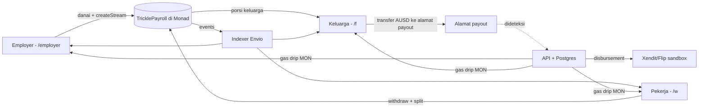

# Trickle — Rencana Eksekusi Monad Metropolis

> **Versi:** 1.1 · dibuat Sabtu, 26 Sep 2026 · diperbarui Kamis, 1 Okt 2026 · pemilik dokumen: Koordinator
> **Track:** 02 — Consumer Products & Payments
> **Mata kuliah:** Pengembangan Aplikasi Web, mode kompetisi (rubrik di §2.4)
> **Deadline resmi:** 13 Okt 2026, 23:59 ET = **Rabu, 14 Okt 2026, 10:59 WIB**
> **Target submit internal:** **Senin, 12 Okt 2026, 21:00 WIB**. Waktu setelahnya adalah buffer darurat, bukan waktu kerja.

Dokumen ini adalah **sumber kebenaran tunggal** untuk scope, pembagian tugas, dan jadwal. Kalau ada yang bertentangan dengan dokumen ini (chat, ingatan, asumsi), yang berlaku adalah dokumen ini. Mau mengubah scope atau jadwal? Ubah dokumennya dulu lewat Decision Log (§9), baru ubah kerjanya.

Cara membaca: setiap fase punya **tugas**, **output** (artefak yang harus bisa ditunjuk atau dibuka), dan **gate** (syarat lulus). Kalau output belum ada, gate belum lulus. Fitur baru di fase berikutnya tidak dimulai sebelum gate diputuskan.

**Perubahan v1.1 (1 Okt):**
- Rubrik mata kuliah mode kompetisi dipetakan ke rencana (§2.4, §11.3, §14).
- API dirombak menjadi REST berbasis resource dengan CRUD penuh, otorisasi peran, dan enkripsi data sensitif (§6.3).
- Listener event dan pemantauan treasury dipindah dari BE ke SC untuk menyeimbangkan beban (§5).
- D2 dikunci: PWA. Aturan keputusan D1, D6, D8 diperbarui; D10 dan D11 ditambahkan (§9).
- Validasi problem, peta kontribusi, dan persiapan tanya jawab individu ditambahkan (§7 F2, §8.7).

## Tim

| Peran | Nama | Area utama |
|---|---|---|
| Koordinator (dirangkap salah satu anggota) | _isi_ | Keputusan, gate review, Discord, registrasi, submission |
| SC — Smart Contract | _isi_ | `contracts/`, `packages/shared/`, `indexer/` |
| BE — Backend | _isi_ | `apps/api/`, database, hosting, integrasi pihak ketiga |
| FE-A — Pekerja & Keluarga | _isi_ | `apps/web` rute `/w` dan `/f`, modul akun Mera |
| FE-B — Employer & Polish | _isi_ | `apps/web` rute `/` dan `/employer`, design system, video, write-up |

## Daftar isi

1. [Timeline sekilas](#1-timeline-sekilas)
2. [Aturan lomba, kriteria penilaian & rubrik kuliah](#2-aturan-lomba-kriteria-penilaian--rubrik-kuliah)
3. [Batas scope](#3-batas-scope)
4. [Arsitektur](#4-arsitektur)
5. [Peran & batas kepemilikan](#5-peran--batas-kepemilikan)
6. [Kontrak antar-peran](#6-kontrak-antar-peran)
7. [Rencana per fase: tugas, output, gate](#7-rencana-per-fase-tugas-output-gate)
8. [Ritme kerja & aturan main](#8-ritme-kerja--aturan-main)
9. [Decision log](#9-decision-log)
10. [Risiko & cut list](#10-risiko--cut-list)
11. [Checklist submission](#11-checklist-submission)
12. [Draft skrip video](#12-draft-skrip-video--300)
13. [Definition of Done umum](#13-definition-of-done-umum)
14. [Jalur mata kuliah setelah Metropolis](#14-jalur-mata-kuliah-setelah-metropolis)

---

## 1. Timeline sekilas

| Tanggal | Hari | Fase | Milestone |
|---|---|---|---|
| 26–27 Sep | Sab–Min | **F0** Fondasi & keputusan | **G0** Min 27 Sep, 22:00: keputusan inti terkunci, ABI & design tokens freeze, repo siap |
| 28 Sep–1 Okt | Sen–Kam | **F1** Core loop | Sel 29: kontrak live di testnet. **G1** Kam 1 Okt, 22:00: golden path jalan end-to-end (UI kasar) |
| 2–7 Okt | Jum–Rab | **F2** Lengkapi | Jum 2: form submission dibuka. **G2** Rab 7 Okt, 23:59: **FEATURE FREEZE** |
| 8–10 Okt | Kam–Sab | **F3** QA & hardening | **G3** Sab 10 Okt, 22:00: release candidate, 0 bug P0/P1 |
| 11–12 Okt | Min–Sen | **F4** Submission | **G4** Sen 12 Okt, 21:00: tersubmit, status bukan draft |
| 13 Okt–14 Okt 10:59 | Sel–Rab | Buffer | Hanya perbaikan darurat. Tidak ada fitur baru. |
| 14 Okt–3 Nov | — | Penjurian | Production & judge mode wajib tetap hidup |

**Level "selesai" di tiap gate**

| Gate | Standar |
|---|---|
| G0 | Belum ada kode fitur. Yang ada: keputusan, spec, skeleton repo yang jalan. |
| G1 | Fungsional, tampilan kasar boleh. Semua transaksi real di testnet. State error belum wajib. |
| G2 | Semua fitur **Must** selesai dan memenuhi DoD §13 (semua state, tampilan layak). Setelah ini hanya perbaikan bug. |
| G3 | Release candidate di domain production, lulus uji cold-start oleh orang luar, 0 bug P0/P1 terbuka. |
| G4 | Tersubmit lengkap, semua link bisa dibuka dari jendela incognito. |

---

## 2. Aturan lomba, kriteria penilaian & rubrik kuliah

> **Catatan verifikasi:** rubrik dan aturan di bawah diambil dari salinan "Metropolis Hackathon Rules & Guidelines" (v3.0) yang dikutip peserta lain di repo publik mereka, karena halaman publik Metropolis tidak mencantumkan rubrik. **Koordinator wajib membaca Rules modal asli di dashboard (hackathon.monad.xyz) di F0 dan mengoreksi bagian ini kalau ada yang berbeda.**

### 2.1 Kriteria penilaian (masing-masing 20%)

| Kriteria | Artinya untuk kita | Pemilik utama | Bukti di submission |
|---|---|---|---|
| Product Quality & Completeness | Golden path jalan 100% untuk orang asing, tanpa tombol mati | FE-A, FE-B | Link live, judge mode, video |
| Technical Excellence | Kontrak aman dan teruji, kode rapi, arsitektur jelas | SC, BE | Test + fuzz + invariant hijau di CI, laporan Slither, README arsitektur |
| Monad Integration | Transaksi real; alasan memakai Monad dibuktikan, bukan cuma diklaim | SC | Alamat kontrak, tx hash, bagian "Why Monad", (opsional) hasil benchmark |
| Track Fit & Problem Relevance | Terasa seperti aplikasi pembayaran biasa; kata "blockchain", "gas", "wallet" tidak muncul di jalur utama | FE-A | UI dan video |
| Innovation & Impact | Gaji mengalir per detik + auto-split ke keluarga; jalur ke production dijelaskan jujur | Semua | Write-up dan video |

### 2.2 Aturan yang mengikat dan dampaknya

| Aturan | Dampak ke kerja kita |
|---|---|
| Open source dengan lisensi OSI, repo publik di GitHub | Tambah `LICENSE` (MIT) di F0. Jangan pernah commit secret. |
| Sebagian besar kerja harus dibuat selama periode hackathon dan terlihat di commit history | Commit kecil setiap hari kerja. Jangan satu commit besar di akhir. Saat ini repo baru berisi 1 commit (README). |
| Penggunaan AI coding tools wajib diungkap di README | Setiap anggota mengisi log AI (§8.5). Disusun jadi bagian README di F4. |
| Video maksimal 3:00, publik, menampilkan produk berjalan dan interaksi on-chain, bukan mockup atau slide | Ikuti skrip §12, rekam di F4. |
| Testnet atau mainnet sama-sama boleh; wajib mencantumkan alamat kontrak/tx hash dan alasan memakai Monad | `packages/shared/deployments/testnet.json` + bagian "Why Monad" di README. |
| Form submission dibuka 2 Okt, bisa diedit sampai deadline; versi saat deadline yang dinilai | Isi draft sejak 2 Okt. Submit versi final 12 Okt. Update kalau perlu. |
| Tim 1–5 orang, satu proyek, satu track | Kita 4 orang, Track 02. |
| Review tidak bersifat rahasia (judge termasuk investor dan operator) | Tidak ada yang rahasia atau sensitif di repo. |

### 2.3 Bounty yang dibidik (belum final, lihat D9)

| Bounty | Syarat (ringkas) | Status |
|---|---|---|
| Agora: Best Cross-Border Payments App on Monad ($10k) | Aplikasi mobile untuk kirim AUSD lintas negara, onboarding passkey Mera, settlement instan | Bergantung pada D2 (apakah PWA dihitung "mobile app") dan D3 (AUSD) |
| Monad Foundation: Best Mera-Powered UX ($2.5k) | Mera menjadi seluruh lapisan akun: tanpa seed phrase, tanpa extension, tanpa custody backend | Otomatis sejalan kalau D1 = Mera |
| Envio: Best Use of Envio ($1k) | Envio menggerakkan data on-chain untuk fitur inti | Bergantung pada D7 |
| Privy ($5k) | Integrasi Privy lebih dari sekadar login | Kalau D1 = Privy: gas sponsorship dan policy wallet harus benar-benar dipakai |

Bounty dinilai 40% dari kepatuhan pada syarat bounty tersebut. Ambil hanya bounty yang syaratnya bisa kita penuhi **penuh**.

### 2.4 Rubrik mata kuliah (mode kompetisi)

Sumber: spreadsheet rubrik mode kompetisi dari pengampu. Rubrik ini menilai beberapa hal yang **tidak** dinilai juri Metropolis (REST API, CRUD, otorisasi, kontribusi individu), jadi keduanya harus dipenuhi sekaligus.

**Batas kelayakan (lulus/tidak; tidak menyumbang nilai, tapi satu saja gagal adalah masalah besar)**

| Kode | Syarat | Cara kita memenuhinya | Pemilik |
|---|---|---|---|
| K1 | REST API terstruktur, penamaan konsisten | API berbasis resource, kata benda jamak, prefix `/api/v1`, format error seragam, terdokumentasi di OpenAPI (§6.3) | BE |
| K2 | Data persisten dengan skema/relasi jelas | Postgres + migrasi + ERD di `docs/erd.md` | BE |
| K3 | CRUD lengkap lewat API | CRUD penuh untuk resource off-chain: perusahaan, pekerja, penerima (keluarga), rekening bank, undangan. Aturan hapus untuk data yang terkait stream on-chain ada di §4.2 | BE (API), FE-A & FE-B (UI) |
| K4 | Kata sandi dan info sensitif tersandi | Tidak ada kata sandi (login tanpa kata sandi lewat Privy/Mera). Nomor rekening dienkripsi at-rest, token sesi disimpan sebagai hash, secret hanya di env. **Konfirmasi ke pengampu bahwa login tanpa kata sandi memenuhi K4 (D10).** | BE |
| K5 | API sensitif hanya untuk peran berwenang | Middleware RBAC dengan peran `employer`, `worker`, `recipient` (+ `admin` kalau D10 mengharuskan), plus cek kepemilikan data; diuji otomatis | BE |
| K6 | Frontend berbasis komponen (SPA/SSR) | Next.js | FE-A, FE-B |

**Komponen bernilai (total 100%)**

| Kode | Bobot | Syarat skor 5 | Tindakan di rencana | Pemilik |
|---|---|---|---|---|
| C1 Ketepatan fitur & mutu solusi | 30% | Fitur menjawab **seluruh** masalah yang dirumuskan kelompok, ditambah fitur pendukung yang jelas manfaatnya. Dinilai relatif terhadap rumusan masalah dan kontrak kompleksitas kelompok | `docs/problem.md` dengan matriks Masalah → Fitur → Bukti. Rumusan masalah hanya menjanjikan yang benar-benar dijawab. Kontrak kompleksitas diselaraskan dengan §3.3 | Koordinator |
| C2 Mutu rekayasa | 25% | Berkas tertata, komponen reusable, logika terpisah dari tampilan, galat ditangani, input divalidasi menyeluruh | BE berlapis route → controller → service → repository. Validasi skema di FE dan BE. FE memisahkan hooks/services dari komponen. Lint + test di CI | Semua |
| C3 Proses pengembangan | 10% | Commit bertahap dan konsisten sepanjang periode | Commit harian per orang (§8.2); tetap bertahap setelah 13 Okt kalau periode kuliah lebih panjang (§14) | Semua |
| C4 Kontribusi individu | 15% | Mengerjakan seluruh bagiannya **dan mampu mempertahankan seluruh kodenya**. Tidak bisa menjelaskan = nol untuk bagian itu, walaupun kodenya berjalan | Peta kontribusi + latihan tanya jawab (§8.7). Jangan merge kode yang tidak bisa dijelaskan sendiri | Setiap anggota |
| C5 Video presentasi | 5% | Memenuhi semua ketentuan; maksimal 10 menit | Video kuliah **terpisah** dari video Metropolis (maks 3 menit). Ketentuan lengkap diminta ke pengampu (§14) | FE-B |
| C6 Presentasi & pitching | 15% | Runtut dan meyakinkan, demo lancar, semua pertanyaan terjawab. Penyisihan dinilai pengampu, Demo Day bersama praktisi industri | Skrip pitch + demo cadangan (§14) | Semua |

**Penyesuaian nilai (di luar 100%)**

| Kode | Isi | Implikasi untuk kita |
|---|---|---|
| T1 | Integrasi pihak ketiga, maks +5, paling banyak 2 jenis fitur sesuai daftar di rubrik mode reguler | Kandidat: autentikasi pihak ketiga (Privy/Mera) dan payment gateway (Xendit/Flip). Cocokkan dengan daftar mode reguler (D11) |
| T2 | Bonus kompetisi: finalis +5, pemenang +8 | Konfirmasi ke pengampu apakah hasil Metropolis yang dihitung |
| T3 | Pengurang keterlambatan, maks −10 | Tenggat kuliah dijaga sama ketatnya dengan tenggat lomba |
| T4 | Penalti batal bertanding, maks −20 | **Tidak submit ke Metropolis = penalti.** G4 bukan opsional |

Catatan penerapan dari rubrik: README wajib berisi petunjuk menjalankan aplikasi secara lengkap, dan setiap anggota wajib mempertahankan kodenya sendiri di sesi tanya jawab.

---

## 3. Batas scope

### 3.1 Golden path (inilah produknya)

1. **Employer** (web, `/employer`): login dengan passkey, buat profil perusahaan, tambah pekerja (nama, gaji bulanan dalam USD), dapat link undangan, lalu danai gaji satu periode. Stream mulai berjalan.
2. **Pekerja** (PWA, `/w`): buka link undangan, buat akun dengan Face ID atau sidik jari, lalu lihat gaji bertambah setiap detik (USD dan estimasi IDR). Pekerja mengundang keluarga, mengatur "kirim X% ke keluarga", lalu menarik saldo. Pembagian ke keluarga terjadi on-chain dalam transaksi yang sama.
3. **Keluarga** (PWA, `/f`): buka link undangan, buat akun passkey, lihat saldo dalam rupiah, lalu cairkan ke rekening bank (sandbox).
4. **Employer**: melihat sisa runway, total yang sudah mengalir, dan riwayat penarikan secara real-time.
5. **Judge mode** (landing, tombol "Coba sebagai pekerja"): membuat stream testnet **sungguhan** dari akun employer demo ke akun passkey baru milik pengunjung (misalnya $50 selama 1 jam), lalu langsung membuka layar pekerja. Pengunjung melihat saldo naik dalam hitungan detik tanpa faucet, tanpa wallet.

### 3.2 Apa yang real dan apa yang sandbox

| Komponen | Status di submission | Catatan untuk write-up |
|---|---|---|
| Stream gaji, penarikan, split, cancel | **Real**, kontrak di Monad testnet | Tx hash dicantumkan |
| Akun pengguna (Privy atau Mera, sesuai D1) | **Real** | Tanpa seed phrase, tanpa kata sandi |
| Biaya gas | **Real**, disponsori sistem (gas sponsorship Privy atau gas drip, sesuai D6) | Pengguna tidak pernah memegang atau melihat MON |
| Stablecoin | AUSD testnet, atau token test sendiri kalau faucet AUSD tidak tersedia (D3) | Kalau token test: disebut terang-terangan |
| Kurs USD→IDR | **Real**, dari API kurs publik | Hanya untuk tampilan dan estimasi |
| On-ramp employer (fiat → AUSD) | **Tidak dibangun.** Employer demo didanai dari treasury tim | Jelaskan jalur production: partner on-ramp berizin |
| Off-ramp keluarga (AUSD → IDR ke rekening) | Transfer AUSD ke alamat payout **real on-chain**; pencairan IDR via **sandbox** Xendit/Flip (API asli, test mode) | UI diberi label "Mode uji". Production butuh partner berizin (BI/OJK) |

**Aturan keras:** tidak ada data palsu yang ditampilkan seolah-olah real. Kalau sesuatu berjalan di sandbox, UI mengatakannya.

### 3.3 Prioritas (MoSCoW)

**Must** (tanpa ini kita tidak submit):
- Kontrak: `createStream`, `withdraw` + split, `setSplit`, `cancel`, fungsi view, events, beserta test, fuzz, dan invariant.
- Onboarding akun tanpa seed phrase untuk tiga peran lewat `account.ts` (provider sesuai D1), plus layar fallback kalau D1 = Mera dan perangkat tidak mendukung PRF.
- Gas disponsori otomatis (sesuai D6).
- Layar pekerja dengan saldo yang bertambah per detik dan tombol tarik.
- Undangan pekerja dan keluarga.
- Dashboard employer: tambah pekerja, danai stream, lihat status.
- Layar keluarga dengan pencairan sandbox.
- Judge mode.
- CRUD penuh lewat REST API untuk perusahaan, pekerja, penerima, rekening bank, dan undangan, dengan otorisasi peran dan validasi input (K1, K3, K5).
- Enkripsi data sensitif at-rest dan ERD (K2, K4).
- `docs/problem.md` dengan matriks Masalah → Fitur → Bukti (C1).
- Semua state (loading, sukses, gagal, kosong) di sepanjang golden path.
- README lengkap, video maksimal 3:00, submission.

**Should** (dikerjakan, tapi boleh dipotong sesuai §10.2):
- Indexer Envio untuk riwayat dan runway (fallback: listener di BE).
- Alur cancel stream di UI employer.
- Bilingual Indonesia/Inggris.
- Riwayat transaksi dan struk yang detail.

**Could** (hanya kalau G2 lulus lebih awal):
- Deploy ke mainnet dan satu stream AUSD asli bernilai kecil untuk video (D8).
- Script benchmark penarikan massal untuk bagian "Why Monad".
- "Lihat sisi keluarga" di judge mode memakai akun turunan kedua dari passkey yang sama.
- Relayer EIP-712 sebagai pengganti gas drip.

**Won't** (tidak dikerjakan dan **tidak di-stub**):
- Aplikasi native (D2 dikunci: PWA).
- KYC/KYB, pajak, slip gaji.
- Pause/resume stream, jadwal gaji berulang otomatis.
- Multi-token atau mata uang selain USD→IDR.
- Remit otomatis terjadwal via keeper (diganti split saat penarikan).
- Notifikasi email atau WhatsApp.
- Multi-admin untuk employer.

Ide baru yang muncul di tengah jalan otomatis masuk **Won't** sampai setelah G4.

---

## 4. Arsitektur



### 4.1 Struktur repo

```
Trickle/
├── contracts/            # Foundry (SC)
│   ├── src/TricklePayroll.sol
│   ├── test/
│   └── script/Deploy.s.sol
├── packages/shared/      # ABI, alamat deploy, tipe TS (SC mem-publish, semua mengonsumsi)
│   └── deployments/testnet.json
├── apps/web/             # Next.js PWA: /, /employer, /w, /f (FE-A & FE-B)
├── apps/api/             # Node.js + TypeScript + Postgres (BE)
│   └── src/              # routes → controllers → services → repositories, middleware, validators, chain/ (SC)
├── indexer/              # Envio HyperIndex (SC, Should)
├── docs/                 # PLAN.md, problem.md, erd.md, contributions.md, device-matrix.md, security.md, ai-log.md
├── LICENSE
└── README.md
```

### 4.2 Prinsip data (batas yang tidak boleh dilanggar)

- **Uang hanya ada di chain.** Saldo, jumlah yang sudah mengalir, dan riwayat penarikan selalu dibaca dari kontrak atau indexer. Postgres **tidak pernah** menjadi sumber kebenaran untuk saldo.
- **Postgres hanya menyimpan metadata:** profil, nama perusahaan, undangan, relasi pekerja–keluarga, status payout sandbox, log gas drip.
- **Satu domain untuk semua peran.** Passkey terikat ke domain (rpId), jadi `/employer`, `/w`, dan `/f` berada di domain yang sama, dan domain tidak diganti setelah F0.
- **Tidak ada private key pengguna di server.** Satu-satunya key di server adalah signer treasury gas dan signer employer demo (khusus testnet, saldo dibatasi).
- **CRUD hanya untuk data off-chain.** Stream dan penarikan ada di chain dan tidak bisa diubah atau dihapus lewat API. Pekerja atau penerima yang masih terkait stream aktif tidak bisa dihapus (API mengembalikan 409); employer harus cancel stream dulu. Penghapusan memakai soft delete (`deleted_at`) supaya riwayat tetap utuh.
- **Data sensitif dienkripsi sebelum masuk database.** Nomor rekening disimpan terenkripsi dan hanya 4 digit terakhirnya yang pernah dikirim ke FE.

---

## 5. Peran & batas kepemilikan

Setiap folder punya satu pemilik. Anggota lain boleh membuka PR ke area tersebut, tapi pemiliknya yang me-review dan menyetujui.

| Peran | Memiliki | Tidak mengerjakan | Butuh dari | Menyerahkan ke |
|---|---|---|---|---|
| **SC** | `contracts/`, `packages/shared/`, `indexer/`, layanan rantai di `apps/api/src/chain/` (listener event, pemantauan treasury, gas drip bila D1 = Mera), keamanan kontrak, bagian README "Why Monad" + alamat kontrak | UI, endpoint CRUD | Keputusan D3, D6 | ABI (G0) → semua; kontrak + alamat testnet (Sel 29) → semua; endpoint indexer (F2) → FE |
| **BE** | `apps/api/` (kecuali `src/chain/`), database + ERD, auth sesi, RBAC, CRUD semua resource, enkripsi data sensitif, undangan, payout sandbox + webhook, kurs, judge mode, hosting, secret | UI; menghitung saldo sendiri | ABI + alamat (SC), D4, D5, D10 | OpenAPI (Sen 28, direvisi v1.1) → FE; endpoint di preview (F1–F2) → FE; production (F3) |
| **FE-A** | Rute `/w` dan `/f`, modul akun `account.ts` (provider sesuai D1), komponen saldo berjalan, layar fallback PRF, UI CRUD penerima & rekening bank, teks produk di jalur pekerja & keluarga | Dashboard employer, landing | ABI (SC), API (BE), design tokens (FE-B) | Modul Mera (Rab 30) → FE-B; rekaman layar HP (F4) → FE-B |
| **FE-B** | Rute `/` dan `/employer`, design system, PWA manifest, deploy web, UI CRUD pekerja & perusahaan, video Metropolis + video kuliah, write-up, form submission | Jalur pekerja & keluarga | Modul Mera (FE-A), ABI (SC), API (BE) | Design tokens (G0) → FE-A; video & submission (F4) |
| **Koordinator** | Decision log, gate review, pertanyaan ke Discord, komunikasi dengan pengampu, `docs/problem.md`, registrasi tim & proyek, verifikasi Rules, eskalasi blocker | Tidak menjadi peran penuh waktu terpisah | Laporan standup | Keputusan tercatat di §9 |

**Penyeimbangan beban v1.1:** rubrik kuliah (K1–K5) menambah banyak pekerjaan di BE, sementara SC lebih longgar setelah kontrak selesai. Karena itu listener event dan pemantauan treasury pindah ke SC di `apps/api/src/chain/`. Gas drip ikut pindah hanya kalau D1 = Mera dan BE belum menyelesaikannya. Kode di folder itu dimiliki dan dipertahankan SC di sesi tanya jawab.

---

## 6. Kontrak antar-peran

### 6.1 Jadwal freeze

| Artefak | Pemilik | Freeze | Konsumen |
|---|---|---|---|
| ABI + skema event | SC | Min 27 Sep, 22:00 | FE-A, FE-B, BE, indexer |
| Design tokens + komponen dasar | FE-B | Min 27 Sep, 22:00 | FE-A |
| OpenAPI spec | BE | Sen 28 Sep, 22:00 | FE-A, FE-B |
| Modul akun Mera | FE-A | Rab 30 Sep, 22:00 | FE-B |
| Alamat kontrak testnet | SC | Sel 29 Sep | Semua |

Setelah freeze, perubahan butuh persetujuan semua konsumen di grup tim dan dicatat di Decision Log. Sampai kontrak ter-deploy di testnet, FE dan BE bekerja memakai Anvil lokal dengan ABI yang sama.

### 6.2 Spec kontrak (draft, difinalkan SC di F0)

**`TricklePayroll.sol`**

Fungsi:
- `createStream(address worker, uint128 amount, uint40 start, uint40 end) returns (uint256 streamId)`: dipanggil employer. Token ditarik di depan (prefund penuh). Pakai `permit` kalau AUSD mendukung EIP-2612; kalau tidak, `approve` + `createStream`.
- `withdraw(uint256 streamId)`: hanya pekerja pemilik stream. Menarik semua yang tersedia. Kalau pekerja punya split aktif, porsi `bps` dikirim ke penerima dalam transaksi yang sama.
- `setSplit(address recipient, uint16 bps)`: disimpan per pekerja (`msg.sender`) dan berlaku untuk semua stream-nya. `bps ≤ 10_000`. `recipient = address(0)` berarti split dimatikan.
- `cancel(uint256 streamId)`: hanya employer. Porsi yang sudah mengalir tetap bisa ditarik pekerja; sisanya langsung dikembalikan ke employer.
- View: `getStream(id)`, `streamedAmount(id)`, `withdrawable(id)`, `splitOf(worker)`.

Events:
- `StreamCreated(streamId, employer, worker, amount, start, end)`
- `Withdrawn(streamId, worker, toWorker, recipient, toRecipient)`
- `SplitUpdated(worker, recipient, bps)`
- `StreamCanceled(streamId, streamedAtCancel, refunded)`

Aturan desain:
- Satu token yang ditetapkan saat deploy (AUSD atau token test).
- Storage setiap stream terisolasi, dan **tidak ada counter global yang ditulis di jalur `withdraw`**. Tujuannya agar penarikan antar pekerja tidak saling konflik di eksekusi paralel Monad. Ini bahan utama untuk kriteria Monad Integration.
- `streamed = amount × (min(now, end) − start) / (end − start)`, bukan `rate × elapsed`, untuk menghindari debu pembulatan pada token 6 desimal.
- Checks-effects-interactions, `nonReentrant`, `SafeERC20`.
- Invariant: untuk setiap stream `withdrawn + refunded ≤ amount`, dan saldo token kontrak = Σ(`amount − withdrawn − refunded`) seluruh stream.
- Sebelum menulis kontrak, baca bagian perbedaan Monad dengan Ethereum di docs Monad.

### 6.3 Spec API (v1.1: direvisi untuk rubrik kuliah K1, K3, K4, K5)

> Revisi ini terjadi setelah freeze OpenAPI 28 Sep dan berlaku sebagai perubahan resmi v1.1. FE menyesuaikan pemanggilan API di F2.

Semua endpoint memakai prefix `/api/v1`. Peran: **E** = employer, **W** = pekerja, **R** = penerima (keluarga), **Pub** = tanpa login. "Pemilik" berarti hanya pemilik data tersebut.

| Resource | Endpoint | Fungsi | Akses |
|---|---|---|---|
| Sesi | `POST /sessions/challenges` | Nonce untuk ditandatangani (hanya bila D1 = Mera) | Pub |
| | `POST /sessions` | Buat sesi: verifikasi tanda tangan (Mera) atau access token Privy | Pub |
| | `DELETE /sessions/current` | Logout | E, W, R |
| Pengguna | `GET /users/me`, `PATCH /users/me` | Profil sendiri | E, W, R |
| Perusahaan | `POST /companies`, `GET /companies/:id`, `PATCH /companies/:id`, `DELETE /companies/:id` | CRUD profil perusahaan | E pemilik |
| Pekerja | `POST /companies/:id/workers`, `GET /companies/:id/workers`, `GET /workers/:id`, `PATCH /workers/:id`, `DELETE /workers/:id` | CRUD data pekerja (nama, jabatan, gaji referensi). Hapus ditolak 409 kalau stream masih aktif | E perusahaan terkait; W hanya `GET` dirinya sendiri |
| Penerima | `POST /recipients`, `GET /recipients`, `GET /recipients/:id`, `PATCH /recipients/:id`, `DELETE /recipients/:id` | CRUD anggota keluarga penerima | W pemilik |
| Undangan | `POST /invites`, `GET /invites/:code`, `POST /invites/:code/acceptance`, `DELETE /invites/:id` | Buat, lihat, terima, batalkan undangan | Buat & batalkan: E (undang pekerja), W (undang keluarga). Lihat: Pub. Terima: yang diundang |
| Rekening bank | `POST /bank-accounts`, `GET /bank-accounts`, `PATCH /bank-accounts/:id`, `DELETE /bank-accounts/:id` | Rekening tujuan pencairan; nomor dienkripsi, API hanya mengembalikan 4 digit terakhir | R pemilik |
| Pencairan | `POST /payouts`, `GET /payouts`, `GET /payouts/:id` | Verifikasi tx transfer ke alamat payout → disbursement sandbox | R pemilik |
| Webhook | `POST /webhooks/payout-provider` | Status dari Xendit/Flip; signature diverifikasi | Provider |
| Kurs | `GET /fx-rates/usd-idr` | Kurs dengan cache 10 menit, disertai waktu kurs | E, W, R |
| Gas | `POST /gas-drips` | Isi MON ke alamat sendiri; idempoten, dibatasi harian (hanya bila D1 = Mera) | E, W, R |
| Demo | `POST /demo-streams` | Judge mode: buat stream demo ke alamat pemanggil | Pub, di-rate-limit |

Konvensi (K1):
- Path memakai kata benda jamak, tanpa kata kerja.
- Status code: 200/201/204 untuk sukses; 400 input rusak; 401 belum login; 403 peran atau kepemilikan salah; 404 tidak ditemukan; 409 konflik (misalnya hapus pekerja dengan stream aktif); 422 validasi gagal; 429 rate limit.
- Format error seragam: `{ "error": { "code", "message", "details" } }`, supaya FE bisa menampilkan pesan yang manusiawi.
- Endpoint list memakai pagination `?limit=&cursor=`.

Aturan keamanan (K4, K5):
- Urutan di setiap endpoint: validasi skema input → cek peran → cek kepemilikan data. Ketiganya di middleware, bukan di controller.
- Setiap endpoint sensitif punya test yang membuktikan peran lain ditolak dengan 403.
- Nomor rekening dienkripsi (AES-256-GCM, kunci di env) sebelum disimpan; token sesi disimpan sebagai hash; tidak ada secret di database.
- `/gas-drips` dan `/demo-streams` di-rate-limit per alamat dan per IP.

---

## 7. Rencana per fase: tugas, output, gate

Format setiap fase: **tujuan** → **tugas dan output per peran** → **gate**. Checkbox dicentang oleh pemilik tugas dan diverifikasi saat gate review.

### F0 — Fondasi & keputusan (Sab 26 – Min 27 Sep)

**Tujuan:** semua keputusan inti terkunci, kontrak antar-peran jelas, dan repo siap dipakai 4 orang secara paralel. Belum ada kode fitur.

**Koordinator**
- [ ] Baca Rules modal asli di dashboard; koreksi §2 kalau ada yang berbeda.
- [ ] Daftarkan tim dan buat proyek di dashboard (nama, deskripsi pendek, link repo, Track 02). Kolom deskripsi satu baris sebaiknya pendek.
- [ ] Tanya di Discord Monad: (1) apakah PWA dihitung "mobile app" untuk bounty Agora Cross-Border, (2) di mana faucet AUSD testnet.
- [ ] Kumpulkan jadwal kuliah/UTS semua anggota sampai 13 Okt; catat hari yang tidak tersedia.
- [ ] Putuskan D1, D4, D6 bersama pemilik terkait (§9).

> **Output:** §2 terverifikasi · tim & proyek terdaftar · pertanyaan Discord terkirim · D1, D4, D6 berstatus Decided

**SC**
- [ ] Setup Foundry (OpenZeppelin, forge-std); `forge build` jalan di CI.
- [ ] Finalkan spec §6.2: fungsi, event, custom error.
- [ ] Tulis `ITricklePayroll.sol` dan publish ABI ke `packages/shared`.

> **Output:** `ITricklePayroll.sol` + ABI ter-commit · spec §6.2 final · **ABI freeze Minggu 22:00**

**BE**
- [ ] Monorepo (pnpm workspaces), lint/format, CI (lint + test + `forge test`).
- [ ] Pilih dan setup hosting: web (mis. Vercel), API + Postgres (mis. Railway/Render + Neon/Supabase).
- [ ] Domain final + HTTPS (D4).
- [ ] Skema DB awal + migrasi.
- [ ] Draft OpenAPI sesuai §6.3.
- [ ] Daftar akun sandbox Xendit **dan** Flip hari ini, karena aktivasi bisa makan waktu (D5).
- [ ] `LICENSE` (MIT), `.env.example`, secret scanning di CI.

> **Output:** repo bisa di-clone dan dijalankan lokal dengan satu perintah · preview deploy otomatis per PR · draft OpenAPI

**FE-A**
- [ ] Uji demo Mera di semua perangkat tim: iOS Safari, Android Chrome, Chrome desktop dengan dan tanpa Google Password Manager. Catat hasilnya di `docs/device-matrix.md`.
- [ ] Wireframe alur pekerja dan keluarga, termasuk layar error dan fallback PRF.
- [ ] Draft teks produk tanpa istilah kripto di jalur utama.

> **Output:** device matrix · wireframe pekerja & keluarga disetujui tim

**FE-B**
- [ ] Scaffold Next.js + PWA manifest di `apps/web` dengan rute `/`, `/employer`, `/w`, `/f`.
- [ ] Design tokens (warna, tipografi, spacing) + komponen dasar: Button, Input, Card, Amount, Toast, Sheet.
- [ ] Wireframe dashboard employer, landing, dan judge mode.

> **Output:** `apps/web` ter-deploy ke preview dengan halaman kosong per rute · **design tokens freeze Minggu 22:00**

**Gate G0 — Minggu 27 Sep, 22:00 WIB**
- [ ] D1, D4, D6 berstatus Decided; D2, D3, D5 punya tanggal keputusan.
- [ ] ABI dan design tokens freeze.
- [ ] Repo jalan lokal di mesin **semua** anggota + preview deploy otomatis.

---

### F1 — Core loop (Sen 28 Sep – Kam 1 Okt)

**Tujuan:** golden path berjalan end-to-end dengan transaksi real di testnet. Tampilan boleh kasar. State error belum wajib.

**SC**
- [ ] Implementasi `TricklePayroll.sol` sesuai §6.2.
- [ ] Unit test semua fungsi, termasuk kasus gagal: pemanggil bukan pekerja/employer, split lebih dari 100%, stream belum mulai atau sudah selesai, tarik dua kali, cancel lalu tarik.
- [ ] Fuzz test untuk perhitungan `streamed`.
- [ ] Deploy ke Monad testnet **Selasa 29 Sep**, verifikasi di explorer, tulis `deployments/testnet.json`.
- [ ] Siapkan token sesuai D3.

> **Output:** kontrak terverifikasi di testnet · alamat di `packages/shared` · test hijau di CI

**BE**
- [ ] OpenAPI freeze (Senin 28 Sep, 22:00).
- [ ] Auth tanda tangan → sesi.
- [ ] Employer + undangan pekerja dan keluarga (buat, lihat, terima).
- [ ] Gas drip: dipicu setelah akun dibuat, idempoten per alamat, batas harian, saldo treasury terpantau.
- [ ] Listener event sementara (viem) → tabel `events` untuk riwayat. Akan digantikan indexer kalau D7 = Envio.

> **Output:** semua endpoint Must di §6.3, kecuali payout dan judge mode, berjalan di preview

**FE-A**
- [ ] Modul akun Mera: buat akun, masuk kembali, alamat tersedia di context aplikasi. **Freeze Rabu 30 Sep.**
- [ ] Alur terima undangan pekerja → buat akun → gas drip.
- [ ] Layar pekerja dengan saldo berjalan per detik. Dihitung lokal dari parameter stream, **bukan polling RPC setiap detik**. Sinkron ulang setiap ada event atau transaksi.
- [ ] Tombol tarik → transaksi real → saldo dan riwayat terbarui.
- [ ] Undang keluarga + atur split (UI minimal).

> **Output:** pekerja baru bisa masuk dari link undangan dan menarik gaji di testnet

**FE-B**
- [ ] Login employer memakai modul Mera dari FE-A.
- [ ] Buat profil perusahaan, tambah pekerja, salin link undangan.
- [ ] Danai dan buat stream (permit, atau approve + create).
- [ ] Daftar stream beserta status (berjalan, selesai).

> **Output:** employer bisa mendanai stream real untuk pekerja yang diundang

**Gate G1 — Kamis 1 Okt, 22:00 WIB** (demo internal 30 menit, direkam)
- [ ] Dari dua perangkat berbeda: employer mendanai → pekerja melihat saldo naik → pekerja menarik dengan split → keluarga menerima AUSD. Semua transaksi terlihat di explorer.
- [ ] Tidak ada langkah yang membutuhkan terminal atau campur tangan manual dari tim.
- [ ] **Kalau gagal:** rapat cut (§10.2) malam itu juga, bukan besok.

---

### F2 — Lengkapi (Jum 2 – Rab 7 Okt)

**Tujuan:** semua fitur Must dan Should selesai, dengan semua state dan tampilan layak. Akhir fase adalah feature freeze.

**Koordinator** (tambahan v1.1)
- [ ] `docs/problem.md` paling lambat **Sabtu 3 Okt**: persona pekerja, keluarga, dan employer; satu koridor; data biaya dan waktu beserta sumbernya; alternatif yang sudah ada dan posisi Trickle; batasan yang jujur; matriks Masalah → Fitur → Bukti.
- [ ] Wawancara 3–5 PMI aktif, mantan PMI, atau keluarganya. Temuannya masuk `docs/problem.md`.
- [ ] Cocokkan kontrak kompleksitas yang diajukan ke pengampu dengan §3.3; catat selisihnya di Decision Log.
- [ ] Konfirmasi ke pengampu: D10, D11, ketentuan video kuliah, tenggat dan jadwal penyisihan/Demo Day, serta apakah T2 mengacu pada hasil Metropolis. Isi jawabannya di §14.
- [ ] `docs/contributions.md`: peta kepemilikan modul per anggota, selaras dengan §5.

> **Output:** `docs/problem.md` final · D10 dan D11 terjawab · jadwal kuliah tercatat di §14 · `docs/contributions.md`

**SC**
- [ ] Invariant test (§6.2) + jalankan Slither. Perbaiki atau jelaskan setiap temuan di `docs/security.md`.
- [ ] Indexer Envio (D7): entitas Stream, Withdrawal, Split, dan query untuk riwayat serta runway employer.
- [ ] (Could) Script benchmark: banyak penarikan dari banyak pekerja berbeda dalam waktu singkat; catat latensi dan hasilnya.
- [ ] Draft bagian "Why Monad" untuk README.
- [ ] (v1.1) Ambil alih listener event dan pemantauan treasury di `apps/api/src/chain/`. Gas drip ikut pindah hanya kalau D1 = Mera dan BE belum menyelesaikannya.

> **Output:** `docs/security.md` · endpoint indexer dipakai FE (atau D7 diputuskan: listener BE) · draft "Why Monad"

**BE**
- [ ] Payout sandbox: verifikasi tx transfer AUSD dari keluarga ke alamat payout → buat disbursement sandbox → webhook memperbarui status.
- [ ] Kurs USD→IDR dengan cache dan fallback kalau API kurs tidak bisa diakses. Waktu kurs ikut ditampilkan.
- [ ] Judge mode `POST /api/v1/demo-streams`: signer employer demo, stream kecil berdurasi pendek, rate limit, saldo demo terpantau.
- [ ] Validasi input, format error seragam, rate limit di semua endpoint.
- [ ] (v1.1) Rombak API ke bentuk §6.3: resource-based, CRUD penuh, RBAC + cek kepemilikan, status code konsisten. OpenAPI diperbarui.
- [ ] (v1.1) Enkripsi nomor rekening at-rest, token sesi disimpan sebagai hash, ERD di `docs/erd.md`.
- [ ] (v1.1) Test otorisasi: setiap endpoint sensitif punya test 403 untuk peran lain.
- [ ] (v1.1) Struktur berlapis route → controller → service → repository; validasi skema di lapisan route.

> **Output:** seluruh §6.3 berjalan di preview

**FE-A**
- [ ] Layar keluarga: saldo dalam rupiah, pencairan (pilih bank, nomor rekening, konfirmasi, status), label "Mode uji".
- [ ] Pengaturan split yang jelas: persentase dan **nama** penerima, bukan alamat.
- [ ] Riwayat dan struk transaksi. Link explorer disembunyikan di bagian "detail".
- [ ] Semua state: loading, transaksi tertunda, sukses, gagal (pesan manusiawi + coba lagi), kosong. Tombol tidak bisa ditekan dua kali.
- [ ] Layar fallback PRF dengan instruksi jelas per browser.
- [ ] Bilingual Indonesia/Inggris (Should).
- [ ] (v1.1) UI CRUD penerima keluarga dan rekening bank keluarga.
- [ ] (v1.1) Logika (hooks/services) dipisahkan dari komponen tampilan.

> **Output:** jalur pekerja dan keluarga lengkap sesuai DoD §13

**FE-B**
- [ ] Dashboard: runway, total yang sudah mengalir, riwayat penarikan (dari indexer atau listener).
- [ ] Alur cancel stream dengan konfirmasi (Should).
- [ ] Landing page: masalah → solusi → tombol "Coba sebagai pekerja".
- [ ] Polish responsif di seluruh `apps/web`.
- [ ] Isi draft submission di dashboard (form dibuka Jumat 2 Okt) + pilih bounty (D9).
- [ ] (v1.1) UI CRUD pekerja dan profil perusahaan, termasuk pesan yang jelas saat hapus ditolak karena stream masih aktif.

> **Output:** jalur employer dan landing lengkap sesuai DoD §13 · draft submission tersimpan

**Gate G2 — Rabu 7 Okt, 23:59 WIB — FEATURE FREEZE**
- [ ] Semua Must selesai dan memenuhi DoD §13.
- [ ] Checklist kelayakan kuliah K1–K6 (§11.3) lulus semua.
- [ ] Should yang belum selesai **dipotong**, tidak dibawa ke F3.
- [ ] Setelah gate: hanya perbaikan bug P0/P1. Tidak ada fitur baru dan tidak ada refactor besar.

---

### F3 — QA & hardening (Kam 8 – Sab 10 Okt)

**Tujuan:** release candidate di domain production yang tahan dipakai orang asing.

**Semua anggota**
- [ ] Uji cold-start dengan minimal 3 orang di luar tim, setidaknya 1 orang yang awam kripto. Mereka tidak dibantu; setiap titik kebingungan dicatat dan jadi tiket.
- [ ] Bug bash di iOS Safari, Android Chrome, dan Chrome desktop (dengan dan tanpa PRF).

**SC**
- [ ] Deploy final (alamat baru kalau ada perubahan), perbarui `deployments/testnet.json`. Setelah ini kontrak dibekukan.
- [ ] (Could, D8) Deploy mainnet + satu stream AUSD asli bernilai kecil untuk video.

> **Output:** alamat final + contoh tx hash untuk README

**BE**
- [ ] Production: RPC dedicated (bukan public RPC), logging, monitoring error.
- [ ] Isi treasury gas dan saldo employer demo agar cukup sampai akhir penjurian (27 Okt), plus alarm saldo rendah.
- [ ] Seed data demo: perusahaan contoh dengan beberapa pekerja dan riwayat.

> **Output:** production stabil · treasury aman sampai 27 Okt

**FE-A dan FE-B**
- [ ] Perbaiki semua temuan cold-start (prioritas P0/P1).
- [ ] Performa: halaman pertama terbuka cepat di HP kelas menengah; tidak ada error di console.

> **Output:** 0 bug P0/P1 terbuka

**Gate G3 — Sabtu 10 Okt, 22:00 WIB — Release candidate**
- [ ] Production di domain final lulus golden path dari perangkat baru, tanpa bantuan.
- [ ] Judge mode berfungsi dari Chrome desktop dan dari HP.
- [ ] 0 bug P0/P1 terbuka.
- [ ] Setelah gate: hanya perbaikan P0.

---

### F4 — Submission (Min 11 – Sen 12 Okt)

**SC**
- [ ] README: alamat kontrak, tx hash, "Why Monad", ringkasan keamanan.

**BE**
- [ ] README: arsitektur (diagram §4), cara menjalankan lokal, daftar env var, bagian disclosure AI (disusun dari `docs/ai-log.md`).

**FE-A**
- [ ] Rekam layar golden path di HP asli (pekerja dan keluarga) sesuai skrip §12.

**FE-B**
- [ ] Edit video maksimal 3:00, unggah secara publik (YouTube/Loom).
- [ ] Write-up final; isi link live, link repo, dan link video di form.
- [ ] Submit **Senin 12 Okt, 21:00 WIB**; simpan screenshot status "submitted".

**Koordinator**
- [ ] Jalankan checklist §11 baris per baris sebelum tombol submit ditekan.
- [ ] Buat tag git `metropolis-submission` di commit yang disubmit dan cantumkan di write-up.

> **Output:** submission lengkap di dashboard

**Gate G4 — Senin 12 Okt, 21:00 WIB**
- [ ] Status submission bukan draft.
- [ ] Semua link bisa dibuka dari jendela incognito.

---

### Buffer (Sel 13 Okt – Rab 14 Okt, 10:59 WIB)

Hanya perbaikan darurat P0 dan perbaikan link. Tidak ada fitur baru.

### Setelah submit (14 Okt – 3 Nov)

- [ ] Production dan judge mode tetap hidup selama penjurian (14–27 Okt). Cek saldo treasury setiap 2 hari.
- [ ] Tidak ada push yang berisiko ke production.
- [ ] Pantau pengumuman Monad soal reset atau gangguan testnet; script deploy dan seed harus siap dijalankan ulang.
- [ ] Lanjutkan jalur mata kuliah di §14.

---

## 8. Ritme kerja & aturan main

### 8.1 Komunikasi
- Standup async setiap hari pukul 09:00 WIB di grup tim, berisi tiga hal: yang selesai kemarin, rencana hari ini, blocker.
- Blocker yang lebih dari 4 jam: tag Koordinator dan pemilik area terkait. Jangan diam.
- Gate review: call 30 menit tepat di jam gate.

### 8.2 Git
- `main` dilindungi. Kerja di branch `feat/...` atau `fix/...`.
- PR kecil, direview satu orang (pemilik area yang disentuh).
- Commit setiap hari kerja. Commit history adalah bukti kerja selama periode hackathon.
- CI wajib hijau sebelum merge.
- Setiap orang commit dengan akun GitHub dan email git miliknya sendiri. Kerja berpasangan memakai trailer `Co-authored-by:`. Riwayat commit dinilai di C3 dan dipakai sebagai bukti di C4.
- Saat submit Metropolis, buat tag `metropolis-submission`. Kerja kuliah setelah 13 Okt lanjut di `main` tanpa mengubah tag itu.

### 8.3 Lingkungan

| Env | Untuk | Chain |
|---|---|---|
| Lokal | Pengembangan | Anvil lokal atau Monad testnet |
| Preview | Setiap PR | Monad testnet |
| Production | Judge dan video | Monad testnet (+ mainnet kalau D8 = ya) |

### 8.4 Secret
- Tidak ada private key, API key, atau file `.env` di repo. Repo publik dan review juri tidak bersifat rahasia.
- Secret hanya disimpan di env hosting. `.env.example` hanya berisi nama variabel.

### 8.5 Log penggunaan AI
Setiap anggota menambahkan baris di `docs/ai-log.md` dengan format: tanggal · area · tool · apa yang dibantu AI · apa yang direview manual. Log ini disusun menjadi bagian disclosure di README saat F4. Disclosure yang spesifik lebih kuat daripada "kami memakai AI".

Untuk mata kuliah ada aturan tambahan: AI boleh membantu, tapi kode yang tidak bisa kamu jelaskan sendiri bernilai nol di C4 walaupun berjalan. Jangan merge kode yang belum kamu pahami.

### 8.6 Tingkat bug

| Tingkat | Definisi | Boleh diperbaiki sampai |
|---|---|---|
| **P0** | Golden path putus, jumlah uang salah, atau data hilang | Kapan saja, termasuk buffer |
| **P1** | Error terlihat atau alur membingungkan di golden path | G3 |
| **P2** | Kosmetik, atau di luar golden path | G2 |

### 8.7 Persiapan tanya jawab individu (C4)

Rubrik kuliah memberi nilai nol untuk bagian yang tidak bisa dijelaskan pemiliknya, walaupun kodenya berjalan. Karena itu:
- `docs/contributions.md` berisi peta kepemilikan per anggota (modul, berkas, endpoint), selaras dengan §5. Dokumen ini menjadi "pembagian kerja yang disepakati".
- Setiap PR berisi deskripsi dengan kata-kata penulisnya sendiri: apa yang diubah, kenapa, dan alternatif yang ditolak. Reviewer boleh menahan PR kalau penulisnya tidak bisa menjelaskan.
- Latihan 15 menit per orang setiap Jumat (2 Okt dan 9 Okt), lalu diulang menjelang penyisihan: jelaskan kode sendiri, anggota lain mencecar pertanyaan.
- Pertanyaan minimum per peran:
  - **SC:** perhitungan `streamed`, perlindungan reentrancy, kenapa storage per stream dipisah, alur cancel.
  - **BE:** alur auth dan sesi, RBAC dan cek kepemilikan, enkripsi rekening, kenapa saldo tidak disimpan di database.
  - **FE-A:** state transaksi dari tap sampai konfirmasi, saldo berjalan tanpa polling, pemisahan logika dan tampilan.
  - **FE-B:** alur danai stream, penanganan error di dashboard, struktur komponen dan design system.

---

## 9. Decision log

| ID | Keputusan | Opsi | Rekomendasi default | Batas waktu | Pemilik | Status |
|---|---|---|---|---|---|---|
| D1 | Lapisan akun | Privy / Mera | **Privy** sebagai default (gas sponsorship bawaan, login tidak bergantung PRF). **Mera** hanya kalau bounty Agora realistis (PWA dihitung) **dan** PRF lulus di device matrix. Apa pun pilihannya, komponen hanya memakai `account.ts` | Kam 1 Okt (G1), mundur dari 27 Sep | Koordinator + FE-A | Open |
| D2 | Bentuk aplikasi pekerja & keluarga | PWA / React Native (Expo) | **PWA** | — | Koordinator | **Decided** |
| D3 | Token | AUSD testnet / token test sendiri | AUSD kalau faucet tersedia; kalau tidak, token test + disclosure | Sen 28 Sep | SC | Open |
| D4 | Domain final | — | Satu domain untuk semua peran, tidak diganti setelah F0 | Min 27 Sep | BE | Open |
| D5 | Sandbox payout | Xendit / Flip | Yang akun sandbox-nya aktif lebih dulu | Sen 28 Sep | BE | Open |
| D6 | Sponsor gas | Gas sponsorship Privy / gas drip MON / relayer EIP-712 | Ikut D1: Privy → sponsorship bawaan Privy; Mera → **gas drip** | Ikut D1 | SC + BE | Open |
| D7 | Sumber data riwayat | Envio / listener BE | Envio; turun ke listener BE kalau belum jalan | Jum 2 Okt | SC | Open |
| D8 | Mainnet | Ya / Tidak | Testnet untuk semua yang disentuh juri; mainnet hanya bukti kecil (1–2 stream AUSD asli antar anggota tim), dan hanya kalau G2 lulus tepat waktu | Kam 8 Okt; majukan ke Jum 2 Okt kalau D1 = Mera + bounty Agora dan AUSD testnet tidak tersedia | SC | Open |
| D9 | Bounty yang dipilih | Agora, Mera UX, Privy, Envio, lainnya | Hanya yang syaratnya terpenuhi penuh | Jum 2 Okt | Koordinator | Open |
| D10 | K4 dengan login tanpa kata sandi | Diterima pengampu / wajib ada login kata sandi | Tanyakan ke pengampu. Kalau wajib, tambah peran `admin` dengan kata sandi ter-hash (argon2 atau bcrypt) | Sab 3 Okt | Koordinator + BE | Open |
| D11 | Dua jenis integrasi untuk bonus T1 | Sesuai daftar di rubrik mode reguler | Autentikasi pihak ketiga + payment gateway, kalau keduanya ada di daftar | Sab 3 Okt | Koordinator | Open |

### Catatan keputusan

Format: `YYYY-MM-DD · ID · keputusan · alasan · siapa`

- 2026-10-01 · D2 · PWA; native masuk Won't · selaras mata kuliah Pengembangan Aplikasi Web (K6), juri bisa langsung membuka link, dan waktu tidak cukup untuk dua klien · tim

---

## 10. Risiko & cut list

### 10.1 Risiko

| Risiko | Dampak | Mitigasi | Pemilik |
|---|---|---|---|
| Passkey di Chrome desktop tidak mengembalikan PRF (kalau tidak tersimpan di Google Password Manager) | Juri tidak bisa masuk | Layar fallback + instruksi; judge mode diuji dari Chrome desktop di G3 | FE-A |
| Public RPC kena rate limit saat penjurian | Aplikasi terlihat rusak | RPC dedicated dari paket gratis untuk peserta | BE |
| Faucet AUSD testnet tidak ada | Tidak bisa memakai AUSD | Token test + disclosure (D3) | SC |
| Domain berubah setelah akun test dibuat | Semua passkey tidak berlaku lagi | Domain final di F0 (D4) dan tidak diganti | BE |
| Bug kontrak | Dana terkunci atau salah hitung | Fuzz + invariant + Slither; kontrak dibekukan di F3 | SC |
| Aktivasi akun sandbox payout lambat | Pencairan keluarga tertunda | Daftar di F0; siapkan dua provider, pakai yang aktif lebih dulu | BE |
| Treasury gas atau saldo demo habis saat penjurian | Judge mode gagal | Saldo cukup sampai 27 Okt + alarm saldo rendah | BE |
| Testnet reset atau gangguan | Data demo hilang | Script deploy + seed siap dijalankan ulang; pantau pengumuman Monad | SC |
| Anggota tidak tersedia (kuliah/UTS) | Jadwal molor | Jadwal ketersediaan dicatat di F0; setiap area punya satu reviewer cadangan | Koordinator |
| Scope creep | Golden path tidak selesai | Semua ide baru masuk "Won't" sampai setelah G4 | Koordinator |
| Pengampu tidak menerima login tanpa kata sandi untuk K4 | Gagal batas kelayakan | Konfirmasi lewat D10; siapkan peran `admin` dengan kata sandi ter-hash sebagai cadangan | Koordinator + BE |
| Anggota tidak bisa menjelaskan kodenya sendiri, terutama kode hasil AI | Nilai nol untuk bagian itu (C4) | §8.7: deskripsi PR dengan kata sendiri, latihan tanya jawab rutin | Setiap anggota |
| Batal submit ke Metropolis | Penalti hingga −20 (T4) | G4 tidak bisa dipotong; buffer 13 Okt dijaga | Koordinator |
| Demo live gagal saat penyisihan atau Demo Day | Nilai C6 turun | Akun demo terdanai, rekaman cadangan, cek jaringan di lokasi | Semua |
| Beban BE melonjak karena K1–K5 | Golden path atau CRUD terlambat | Layanan rantai pindah ke SC (§5); Should lain dipotong lebih dulu, CRUD tidak pernah dipotong | Koordinator |

### 10.2 Cut list

Urutan pemotongan kalau tertinggal. Pemotongan diputuskan **di gate**, bukan di tengah jalan.

1. Mainnet (D8)
2. Script benchmark
3. Envio → listener BE (D7)
4. Bilingual → Inggris saja (juri global)
5. UI cancel (fungsi di kontrak tetap ada)
6. Riwayat detail → daftar sederhana

**Tidak pernah dipotong:** golden path, judge mode, state error di golden path, batas kelayakan kuliah K1–K6, README, video.

---

## 11. Checklist submission

### 11.1 Kepatuhan
- [ ] Repo publik dengan `LICENSE` MIT.
- [ ] Commit history tersebar sepanjang periode hackathon (tidak ada squash besar).
- [ ] README berisi: deskripsi, cara menjalankan lokal, arsitektur, alamat kontrak + tx hash, "Why Monad", disclosure AI yang spesifik, atribusi library dan kode eksternal.
- [ ] Video maksimal 3:00, publik, menampilkan produk berjalan dan interaksi on-chain.
- [ ] Tidak ada secret di repo, termasuk di history commit.
- [ ] Link live dan judge mode bisa dibuka dari jendela incognito.
- [ ] Track 02 terpilih; bounty sesuai D9.

### 11.2 Per kriteria penilaian
- **Product Quality & Completeness**
  - [ ] Golden path lulus dari perangkat baru
  - [ ] Judge mode berfungsi
  - [ ] 0 bug P0/P1
- **Technical Excellence**
  - [ ] Test + fuzz + invariant hijau di CI
  - [ ] `docs/security.md` berisi hasil Slither dan tindak lanjutnya
  - [ ] Arsitektur terdokumentasi
- **Monad Integration**
  - [ ] Alamat kontrak dan tx hash tercantum
  - [ ] Penjelasan storage per stream yang terisolasi dan kaitannya dengan eksekusi paralel
  - [ ] (Could) hasil benchmark
- **Track Fit & Problem Relevance**
  - [ ] Tidak ada istilah kripto di jalur utama
  - [ ] Onboarding tanpa seed phrase terlihat di video
- **Innovation & Impact**
  - [ ] Gaji yang mengalir per detik + auto-split terlihat jelas dalam 60 detik pertama video
  - [ ] Jalur ke production (partner on/off-ramp berizin) dijelaskan dengan jujur

### 11.3 Batas kelayakan & syarat mata kuliah
- [ ] K1: semua endpoint mengikuti konvensi §6.3 dan terdokumentasi di OpenAPI
- [ ] K2: migrasi berjalan dari database kosong; `docs/erd.md` sesuai skema
- [ ] K3: create, read, update, delete bisa didemokan lewat API untuk perusahaan, pekerja, penerima, rekening bank, dan undangan
- [ ] K4: nomor rekening terenkripsi di database (cek langsung di tabel); token sesi tersimpan sebagai hash; D10 terjawab
- [ ] K5: test otorisasi hijau; setiap endpoint sensitif menolak peran lain dengan 403
- [ ] K6: frontend Next.js berbasis komponen
- [ ] README berisi petunjuk menjalankan aplikasi secara lengkap, diuji oleh anggota yang tidak menulisnya
- [ ] `docs/problem.md` berisi matriks Masalah → Fitur → Bukti dan selaras dengan kontrak kompleksitas
- [ ] `docs/contributions.md` selaras dengan riwayat commit setiap anggota

---

## 12. Draft skrip video (≤ 3:00)

| Waktu | Isi | Layar |
|---|---|---|
| 0:00–0:20 | Masalah: pekerja migran dibayar bulanan, padahal keadaan darurat tidak menunggu tanggal gajian; kirim uang ke rumah mahal dan lambat. Pakai angka yang ada sumbernya, atau jangan pakai angka. | Teks + cuplikan singkat |
| 0:20–0:45 | Employer menambah pekerja dan mendanai gaji satu bulan | Dashboard employer |
| 0:45–1:25 | Pekerja masuk dengan Face ID, saldo naik setiap detik, atur 30% untuk keluarga, tarik, selesai dalam hitungan detik | HP pekerja (rekaman asli) |
| 1:25–1:50 | Keluarga melihat saldo dalam rupiah dan mencairkannya ke rekening (mode uji) | HP keluarga |
| 1:50–2:25 | Di balik layar: transaksi di explorer, stream per pekerja yang terisolasi sehingga penarikan bisa berjalan paralel di Monad, gas disponsori | Explorer + diagram |
| 2:25–2:50 | Jalur ke dunia nyata: partner on/off-ramp berizin; apa yang sudah real hari ini dan apa yang masih sandbox | Teks |
| 2:50–3:00 | Ajakan mencoba sendiri: link + tombol "Coba sebagai pekerja" | Landing |

Rekam video terpisah per bagian supaya mudah diedit ulang. Kalau durasi lewat, potong bagian 2:25–2:50 lebih dulu dan pindahkan isinya ke write-up.

Video ini untuk Metropolis. Video mata kuliah (C5, maksimal 10 menit) dibuat terpisah, lihat §14.

---

## 13. Definition of Done umum

Sebuah tugas baru dianggap selesai kalau semua poin ini terpenuhi:

- [ ] Berfungsi di iOS Safari, Android Chrome, dan Chrome desktop, atau menampilkan fallback yang jelas.
- [ ] Punya state loading, sukses, gagal (pesan manusiawi + tombol coba lagi), dan kosong.
- [ ] Tombol aksi tidak bisa memicu transaksi ganda.
- [ ] Angka terformat dengan benar: dolar dengan 2 desimal, rupiah dengan pemisah ribuan, tidak ada angka mentah token.
- [ ] Tidak ada kata "wallet", "gas", "blockchain", atau "token" di jalur utama pengguna.
- [ ] Tidak ada error di console.
- [ ] Sudah di-merge ke `main` lewat PR yang direview, CI hijau, dan ter-deploy ke preview.
- [ ] Khusus kontrak: ada test untuk jalur sukses dan untuk setiap kondisi `revert`.
- [ ] Khusus endpoint API: validasi input, cek peran dan kepemilikan, plus test 403 untuk peran lain (K5).
- [ ] Logika bisnis tidak ditulis langsung di komponen tampilan atau di controller (C2).
- [ ] Pemilik kode bisa menjelaskan setiap bagian yang dia tulis tanpa membuka catatan (C4).

---

## 14. Jalur mata kuliah setelah Metropolis

> Tanggal di bagian ini menunggu konfirmasi pengampu (tugas Koordinator di F2).

| Item | Tanggal | Isi | Pemilik |
|---|---|---|---|
| Tenggat pengumpulan kuliah | _konfirmasi_ | Repo, README, video kuliah | Koordinator |
| Video kuliah (C5, maks 10 menit) | _konfirmasi_ | Ikuti ketentuan pengampu. Usulan isi: masalah dan hasil validasi, demo lengkap, arsitektur, lalu penjelasan singkat bagian setiap anggota | FE-B |
| Penyisihan (C6) | _konfirmasi_ | Pitch + demo live, dinilai pengampu | Semua |
| Demo Day (C6) | _konfirmasi_ | Pitch + demo live bersama praktisi industri | Semua |

Aturan kerja setelah 13 Okt:
- Production yang dipakai juri Metropolis tidak diubah selama penjurian (14–27 Okt). Perbaikan untuk kuliah dikerjakan di preview dan baru masuk production setelah 27 Okt.
- Commit tetap bertahap sampai tenggat kuliah (C3). Jangan menumpuk menjelang tenggat.
- Siapkan demo cadangan untuk penyisihan dan Demo Day: akun yang sudah terdanai dan rekaman video, karena demo live dengan passkey dan testnet bergantung pada jaringan di lokasi.
- Latihan tanya jawab (§8.7) diulang menjelang penyisihan dan Demo Day.

